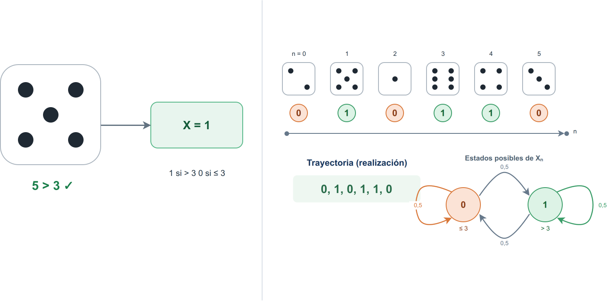
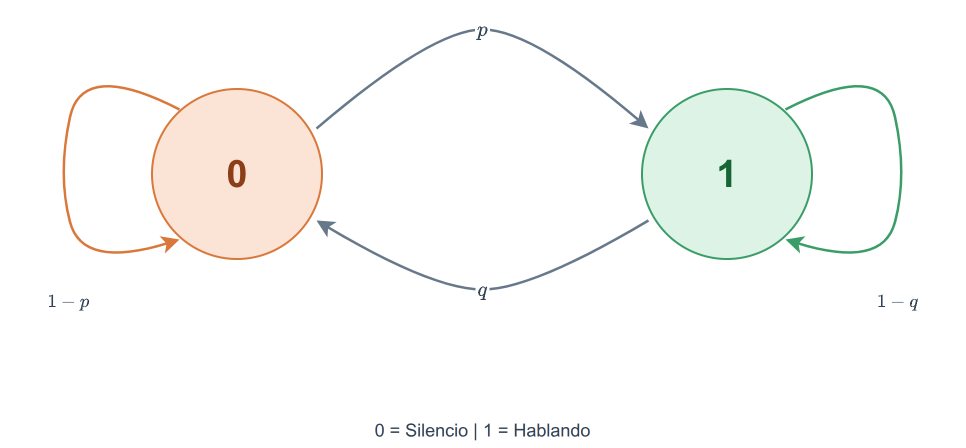
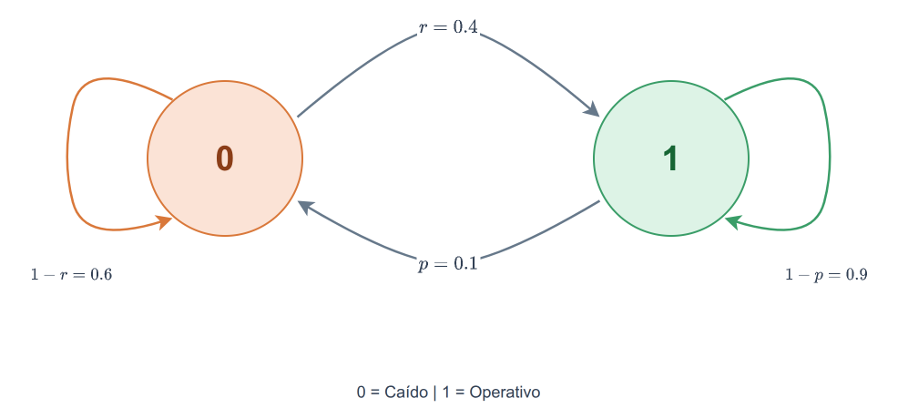
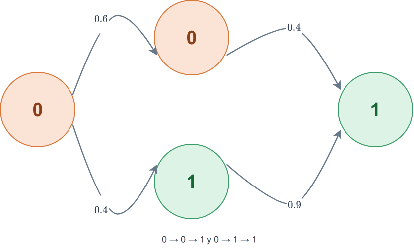
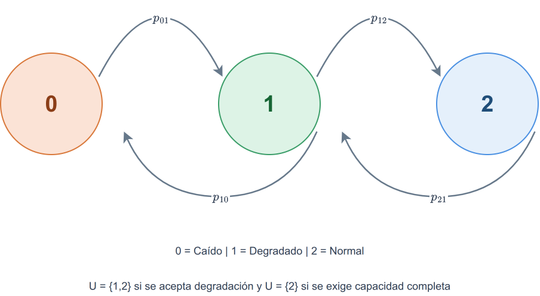
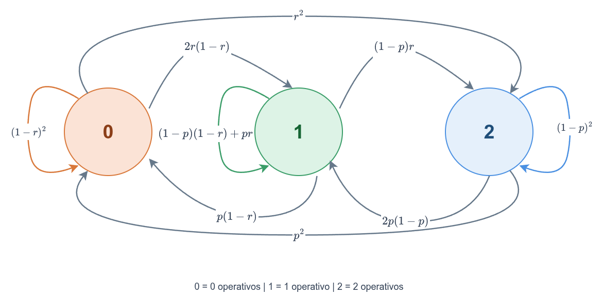

<!-- _class: lead -->

# TEL211
## Disponibilidad y Rendimiento de Sistemas TIC
### Procesos estocásticos y cadenas de Markov en tiempo discreto

Patricio Olivares R.  
Universidad Técnica Federico Santa María

---

## Continuidad

Hasta ahora hemos respondido preguntas como:

> ¿Cuál es la probabilidad de que el sistema complete una misión sin fallar?

Los modelos de confiabilidad y los RBD permiten obtener

$$
R_{\text{sistema}}(t).
$$

Pero una misión de confiabilidad **no incorpora naturalmente la recuperación después de una falla**.

Ahora queremos seguir al sistema mientras cambia de estado: puede funcionar, degradarse, fallar y volver a operar.

---

## De una arquitectura a su evolución

Un RBD responde:

> **¿Qué combinación de componentes debe funcionar?**

Una cadena de Markov responde:

> **¿Cómo cambia el estado del sistema con el tiempo?**

Por ejemplo, un servicio podría evolucionar como

$$
\text{operativo}
\rightarrow
\text{fallado}
\rightarrow
\text{operativo}
\rightarrow
\text{operativo}
\rightarrow\cdots
$$

Ahora interesa conocer **en qué estado se encuentra el sistema en cada instante**, además de saber si falló.

---

## Propósito de esta clase

Al finalizar podremos:

1. representar la evolución aleatoria de un sistema mediante estados.
2. construir e interpretar una matriz de transición.
3. calcular probabilidades después de varios pasos.
4. distinguir comportamiento transiente y estacionario.
5. utilizar una cadena de Markov en tiempo discreto, abreviada DTMC, para describir sistemas reparables.
6. diferenciar estar en un estado después de $n$ pasos de llegar a él por primera vez.

---

## De una variable aleatoria a un proceso

En confiabilidad trabajamos, por ejemplo, con

$$
T=\text{tiempo hasta la primera falla}.
$$

$T$ es **una variable aleatoria**.

Ahora observaremos repetidamente al sistema:

$$
X_0,\,X_1,\,X_2,\ldots
$$

donde $X_n$ indica su estado en el paso $n$.

Un proceso estocástico describe una **secuencia de estados aleatorios**, no solamente un único resultado aleatorio.

---

## Comparación: Variable vs Proceso

Un lanzamiento produce un único valor: el resultado $5$ se transforma en $X=1$. Al repetir el experimento en los pasos $n=0,1,2,\ldots$, obtenemos una secuencia $X_0,X_1,X_2,\ldots$, es decir, una trayectoria del proceso.

---

## Proceso estocástico

Formalmente, un proceso estocástico es una familia de variables aleatorias:

$$
\{X_t:t\in\mathcal T\}.
$$

- $\mathcal T$ indica cuándo observamos el sistema.
- $X_t$ indica su estado en ese instante.

Por ejemplo:

$$
X_n=
\begin{cases}
0,&\text{servicio caído},\\
1,&\text{servicio operativo}.
\end{cases}
$$

---

## Trayectoria

Una **trayectoria** es una realización particular del proceso.

Por ejemplo:

$$
1,\,1,\,0,\,0,\,1,\,1,\,1,\ldots
$$

podría representar

$$
\text{operativo},
\text{operativo},
\text{caído},
\text{caído},
\text{operativo},\ldots
$$

El proceso describe todas las trayectorias posibles. Una trayectoria es solo una realización del proceso.

---

## Ejemplo: Estados en una llamada de voz

Supongamos que observamos una llamada de voz sobre IP (VoIP) cada $20\text{ ms}$. Cada intervalo representa un **paso** del modelo.

En cada paso clasificamos la llamada en uno de dos estados:

- **Silencio**: no se detecta actividad de voz.
- **Hablando**: se detecta actividad de voz.

Así, transformamos una señal continua en una secuencia discreta:

$$
0=\text{silencio},
\qquad
1=\text{hablando}.
$$

La secuencia $X_0,X_1,X_2,\ldots$ registra el estado observado en cada paso.

---

## Ejemplo: Estados en una llamada de voz

Entre dos observaciones consecutivas:

$$
0\to0:1-p,\quad 0\to1:p,
\qquad
1\to1:1-q,\quad 1\to0:q.
$$

donde $p$ y $q$ son probabilidades por intervalo. Las flechas curvas indican permanencias o cambios de estado.

---

## Tiempo y estado

Los procesos se pueden clasificar según dos dimensiones:

| Tiempo | Estado | Ejemplo |
|---|---|---|
| discreto | discreto | estado de un servidor cada minuto |
| continuo | discreto | número de trabajos en una fila |
| discreto | continuo | latencia media medida cada minuto |
| continuo | continuo | temperatura de un procesador |

En esta clase trabajaremos con:

$$
\boxed{\text{tiempo discreto + estados discretos}}
$$

---

## ¿Qué significa tiempo discreto?

Decimos que el tiempo es **discreto** cuando observamos el sistema en instantes separados, llamados pasos, en lugar de seguirlo continuamente.

Al combinar estos pasos con un conjunto discreto de estados y modelar cómo el sistema cambia entre ellos, obtenemos una **cadena de Markov en tiempo discreto**, o **DTMC** (*Discrete-Time Markov Chain*).

Una DTMC observa el sistema en pasos:

$$
n=0,1,2,\ldots
$$

---

## ¿Qué significa tiempo discreto?

Por ejemplo:

$$
1\text{ paso}=1\text{ minuto}.
$$

Entonces

$$
X_5
$$

representa el estado observado a los cinco minutos.

La duración de un paso forma parte del modelo. Una probabilidad de falla por minuto no es lo mismo que una probabilidad de falla por hora.

---

## El estado

El **estado** debe contener la información necesaria para describir la evolución futura.

Ejemplos:

- operativo o fallado.
- número de servidores operativos.
- número de paquetes esperando.
- calidad actual de un enlace.

Definir correctamente el estado es una decisión de modelado, no solo una cuestión de notación.

---

## ¿Cuánta información debe contener el estado?

El estado debe conservar las variables que afectan la próxima transición, pero no toda la historia del sistema.

| Situación | ¿Qué necesitamos conocer? | Estado posible |
|---|---|---|
| Un servidor sin envejecimiento | si está funcionando | $X_n\in\{\text{operativo},\text{fallado}\}$ |
| Dos servidores idénticos | cuántos funcionan | $X_n\in\{0,1,2\}$ |
| Una fila de espera | cuántos paquetes esperan | $X_n=N_n$ |
| Un componente con envejecimiento | condición y edad | $X_n=(C_n,A_n)$ |

Por ejemplo, si el riesgo de falla depende de la edad, dos componentes operativos de edades distintas no deberían representarse con el mismo estado.

Si el futuro depende de una variable que omitimos, el modelo puede dejar de ser Markoviano.

---

## Propiedad de Markov

Una cadena tiene la propiedad de Markov cuando, conocido el estado actual, la historia anterior no agrega información para predecir el siguiente paso:

$$
P(X_{n+1}=j\mid X_n=i,X_{n-1},\ldots,X_0)
=
P(X_{n+1}=j\mid X_n=i).
$$

No significa que el sistema "olvide físicamente" el pasado. Significa que **el estado actual resume toda la información histórica relevante para el modelo**.

---

## Ejemplo de estado mal elegido

Suponga que la probabilidad de falla aumenta con la edad.

Si usamos solamente:

$$
X_n=
\begin{cases}
0,&\text{fallado},\\
1,&\text{operativo},
\end{cases}
$$

dos componentes operativos de edades distintas tendrían el mismo estado, aunque su probabilidad futura de falla sea diferente.

En ese caso, la edad debería incorporarse al estado o utilizarse otro modelo.

---

## Homogeneidad

Además supondremos que la regla de transición no cambia con el número de paso:

$$
P(X_{n+1}=j\mid X_n=i)=p_{ij}.
$$

Esto se llama una **DTMC homogénea**.

Por ejemplo, si un servidor operativo falla durante un minuto con probabilidad $0.1$, utilizaremos esa misma probabilidad en cada paso.

Markov especifica **qué información importa**.  
Homogeneidad especifica que **la regla no cambia con el tiempo**.

---

## Ejemplo: Servicio reparable - Definición

Observamos un servicio una vez por minuto.

Definimos:

$$
X_n=
\begin{cases}
0,&\text{caído},\\
1,&\text{operativo}.
\end{cases}
$$

Durante cada minuto:

- si está caído, se recupera con probabilidad $r=0.4$.
- si está operativo, falla con probabilidad $p=0.1$.

---

## Ejemplo: Servicio reparable - Diagrama de estados

Las flechas curvas representan reparación y falla. Las flechas que vuelven al mismo círculo representan permanencia.

El diagrama muestra **todas las posibilidades del siguiente paso**. Para trabajar con ellas, identificaremos cada flecha mediante su estado de origen y su estado de destino.

---

## Probabilidad de transición

Definimos

$$
p_{ij}=P(X_{n+1}=j\mid X_n=i).
$$

donde $i$ corresponde al estado de origen, y $j$ al estado destino.

Cada enlace $i\to j$ del diagrama de estados se convierte en una entrada $p_{ij}$. Al reunir todas las conexiones según su origen y destino, obtenemos la matriz de transición $P$.

---

## Construcción de la matriz de transición

Supongamos que la cadena tiene $m$ estados. La **matriz de transición** reúne todas las probabilidades de pasar desde un estado hacia otro:

$$
P=(p_{ij})_{m\times m}
=
\begin{bmatrix}
p_{00}&p_{01}&\cdots&p_{0,m-1}\\
p_{10}&p_{11}&\cdots&p_{1,m-1}\\
\vdots&\vdots&\ddots&\vdots\\
p_{m-1,0}&p_{m-1,1}&\cdots&p_{m-1,m-1}
\end{bmatrix}.
$$

Cada fila corresponde a un estado de origen y sus entradas deben sumar $1$:

$$
p_{ij}\geq0,
\qquad
\sum_jp_{ij}=1.
$$

> **fila = origen, columna = destino.**

En una DTMC homogénea, esta matriz es la misma en todos los pasos.

---

## Ejemplo: Servicio reparable - Matriz de transición del servicio

Aplicamos la matriz teórica al servicio reparable y usamos el orden de estados

$$
(0,1)=(\text{caído},\text{operativo}).
$$

Desde el estado $0$:

$$
P(0\to0)=0.6,
\qquad
P(0\to1)=0.4.
$$

Desde el estado $1$:

$$
P(1\to0)=0.1,
\qquad
P(1\to1)=0.9.
$$

Por tanto,

$$
\boxed{
P=
\begin{bmatrix}
0.6&0.4\\
0.1&0.9
\end{bmatrix}}
$$

---

## Cómo leer la matriz

$$
P=
\begin{bmatrix}
0.6&0.4\\
0.1&0.9
\end{bmatrix}
$$

Por ejemplo,

$$
p_{01}=0.4
$$

significa:

> Si el servicio está caído ahora, existe probabilidad $0.4$ de encontrarlo operativo en la próxima observación.

Mientras que

$$
p_{11}=0.9
$$

es la probabilidad de permanecer operativo.

---

## Verificación de la matriz

Cada fila debe representar una distribución de probabilidad:

$$
p_{ij}\geq0
$$

y

$$
\sum_j p_{ij}=1.
$$

En nuestro ejemplo:

$$
0.6+0.4=1,
\qquad
0.1+0.9=1.
$$

Si usamos vectores fila, **las filas de la matriz de transición suman uno**. Mantendremos esta convención durante toda la clase.

---

## Uso de la matriz de transición

La matriz $P$ permite responder directamente preguntas de **un paso**.

Por ejemplo:

> Si el servicio está caído, ¿cuál es la probabilidad de estar operativo dentro del siguiente minuto (tiempo)?

$$
P(X_1=1\mid X_0=0)=p_{01}=0.4.
$$

Pero ¿qué ocurre si queremos mirar dos, diez o cien pasos hacia adelante?

---

## Dos pasos: pensar en trayectorias

Partiendo desde $0$, para estar en $1$ después de dos pasos existen dos posibilidades:

$$
0\to0\to1
$$

o

$$
0\to1\to1.
$$

Por tanto,

$$
P(X_2=1\mid X_0=0)
=
(0.6)(0.4)+(0.4)(0.9).
$$

Así,

$$
\boxed{P(X_2=1\mid X_0=0)=0.60}
$$

---

## Dos caminos

Las ramas curvas corresponden a $0\to0\to1$ y $0\to1\to1$. Sus probabilidades se multiplican y luego se suman.

---

## ¿Por qué se suman esas trayectorias?

Los dos caminos $0\to0\to1$ y $0\to1\to1$ son mutuamente excluyentes.

Sus probabilidades son

$$
0.6\cdot0.4=0.24 \text{ y } 0.4\cdot0.9=0.36.
$$

Entonces:

$$
0.24+0.36=0.60.
$$

---

## Multiplicación matricial para trayectorias

Al calcular

$$
P^2=P\,P
$$

se obtiene

$$
P^2=
\begin{bmatrix}
0.40&0.60\\
0.15&0.85
\end{bmatrix}.
$$

---

## Multiplicación matricial para trayectorias

En general, cada entrada de $P^2$ se calcula como

$$
(P^2)_{ij}=\sum_k p_{ik}p_{kj}.
$$

El índice $k$ recorre los posibles estados intermedios. Por eso, para ir de $0$ a $1$ en dos pasos:

$$
(P^2)_{01}=p_{00}p_{01}+p_{01}p_{11}
=(0.6)(0.4)+(0.4)(0.9)=0.60.
$$

Cada producto representa una trayectoria posible y la suma reúne todas las trayectorias.

---

## Probabilidades en $n$ pasos

Definimos

$$
p_{ij}^{(n)}
=
P(X_n=j\mid X_0=i).
$$

Entonces:

$$
\boxed{p_{ij}^{(n)}=(P^n)_{ij}}
$$

La matriz $P$ describe un paso.

La matriz $P^n$ describe $n$ pasos.

---

## Descomposición de una transición - Chapman Kolmogorov

El cálculo anterior dividió dos pasos en pasos independientes para cada trayectoria. La misma idea se puede aplicar a cualquier recorrido de $n+r$ pasos: primero observamos los $n$ pasos iniciales y luego los $r$ pasos restantes.

Si el sistema pasa por el estado intermedio $k$ al cabo de los primeros $n$ pasos, entonces:

- $p_{ik}^{(n)}$ es la probabilidad de ir de $i$ a $k$ en los primeros $n$ pasos.
- $p_{kj}^{(r)}$ es la probabilidad de ir de $k$ a $j$ en los siguientes $r$ pasos.

---

## Descomposición de una transición - Chapman Kolmogorov

Como el estado intermedio puede ser cualquiera, sumamos sobre todos los valores posibles de $k$:

$$
p_{ij}^{(n+r)}
=
\sum_k
p_{ik}^{(n)}
p_{kj}^{(r)}.
$$

En forma matricial:

$$
\boxed{P^{n+r}=P^nP^r}
$$

Esta identidad se conoce como **ecuación de Chapman-Kolmogorov**. La multiplicación de matrices la expresa de forma compacta.

---

## ¿Por qué es útil Chapman Kolmogorov?

La descomposición permite pasar de una probabilidad de un paso a probabilidades en horizontes más largos:

- Divide un recorrido largo en etapas más simples
- Evita enumerar manualmente todas las trayectorias posibles
- Permite reutilizar cálculos como $P^n$ y $P^r$
- Conecta las transiciones locales con la evolución global del sistema

Esta idea es la base para calcular distribuciones futuras y analizar sistemas durante muchos pasos.

---

## Ejemplo: Servicio reparable - Chapman Kolmogorov

Queremos calcular la probabilidad de que el servicio esté operativo después de cuatro minutos, sabiendo que comenzó caído:

$$
P(X_4=1\mid X_0=0)=p_{01}^{(4)}.
$$

La matriz de transición de un paso es

$$
P=
\begin{bmatrix}
0.6&0.4\\
0.1&0.9
\end{bmatrix}.
$$

---

## Ejemplo: Servicio reparable - Chapman Kolmogorov

Separamos los cuatro pasos como $4=2+2$. Calculamos una sola vez la matriz de dos pasos:

$$
P^2=P\,P=
\begin{bmatrix}
0.40&0.60\\
0.15&0.85
\end{bmatrix}.
$$

El estado intermedio después de los primeros dos pasos puede ser $0$ o $1$:

$$
\begin{aligned}
 p_{01}^{(4)}
&=p_{00}^{(2)}p_{01}^{(2)}+p_{01}^{(2)}p_{11}^{(2)}\\
&=(0.40)(0.60)+(0.60)(0.85)\\
&=0.75.
\end{aligned}
$$

En forma matricial, reutilizamos $P^2$:

$$
P^4=P^2P^2,
\qquad
(P^4)_{01}=0.75.
$$

---

## Del estado inicial conocido a la incertidumbre

Si conocemos el estado inicial $i$, calculamos la probabilidad de llegar a $j$ en $n$ pasos. Si el estado inicial es incierto, pero conocemos sus probabilidades, la probabilidad de estar en $j$ se obtiene sumando las contribuciones de cada origen:

$$
P(X_n=j)=\sum_i P(X_0=i) p_{ij}^{(n)}
$$

Así, las probabilidades iniciales permiten calcular dónde puede estar el sistema tras $n$ pasos.

---

## Representar la incertidumbre inicial

El vector fila reúne las probabilidades iniciales en el mismo orden de los estados en $P$:

$$
\boldsymbol\alpha^{(0)}
=
\begin{bmatrix}
P(X_0=0)&P(X_0=1)
\end{bmatrix}.
$$

Por ejemplo,

$$
\boldsymbol\alpha^{(0)}
=
\begin{bmatrix}
0.3&0.7
\end{bmatrix}
$$

significa que inicialmente hay un $30\%$ de probabilidad de que el servidor esté caído y un $70\%$ de que esté operativo.

Es fila porque cada fila de $P$ describe transiciones desde un estado de origen, y $\boldsymbol\alpha^{(0)}P$ combina esas posibilidades.

---

## Distribución transiente

La distribución transiente es la distribución del sistema tras un número finito de pasos y, en general, depende del estado inicial.

Después de un paso:

$$
\boldsymbol\alpha^{(1)}
=
\boldsymbol\alpha^{(0)}P.
$$

Después de $n$ pasos:

$$
\boxed{
\boldsymbol\alpha^{(n)}
=
\boldsymbol\alpha^{(0)}P^n
}
$$

Cada componente $\alpha_j^{(n)}$ es la probabilidad de encontrar el sistema en $j$ después de $n$ pasos.

---

## Ejemplo transiente

Consideremos el siguiente vector que representa un servidor caído:

$$
\boldsymbol\alpha^{(0)}
=
\begin{bmatrix}
1&0
\end{bmatrix}.
$$

Después de un minuto, se multiplica el vector fila por la matriz:

$$
\begin{aligned}
\boldsymbol\alpha^{(1)}
&=
\underbrace{\begin{bmatrix}1&0\end{bmatrix}}_{\text{vector fila inicial}}
\underbrace{\begin{bmatrix}0.6&0.4\\0.1&0.9\end{bmatrix}}_{\text{matriz }P}\\
&=\underbrace{\begin{bmatrix}0.6&0.4\end{bmatrix}}_{\text{vector fila resultante}}.
\end{aligned}
$$

El resultado también es un vector de probabilidades: 60\% caído y 40\% operativo. Por tanto, la probabilidad de estar operativo al minuto es $0.4$.

---

## Ejemplo transiente: dos pasos

Como

$$
P^2=
\begin{bmatrix}
0.40&0.60\\
0.15&0.85
\end{bmatrix},
$$

entonces

$$
\boldsymbol\alpha^{(2)}
=
\begin{bmatrix}
1&0
\end{bmatrix}P^2
=
\begin{bmatrix}
0.40&0.60
\end{bmatrix}.
$$

La probabilidad de estar operativo después de dos minutos aumentó a

$$
\boxed{0.60}.
$$

---

## Ejemplo transiente: dos pasos con incertidumbre inicial

Supongamos que al inicio el vector fila define las siguientes probabilidades para el servidor en el estado inicial:

$$
\boldsymbol\alpha^{(0)}=
\begin{bmatrix}
0.3&0.7
\end{bmatrix}.
$$

Reutilizamos la matriz de dos pasos del ejemplo anterior:

$$
\begin{aligned}
\boldsymbol\alpha^{(2)}
&=\begin{bmatrix}0.3&0.7\end{bmatrix}
\begin{bmatrix}0.40&0.60\\0.15&0.85\end{bmatrix}\\
&=\begin{bmatrix}0.225&0.775\end{bmatrix}.
\end{aligned}
$$

Después de dos minutos, hay un $22.5\%$ de probabilidad de que el servicio esté caído y un $77.5\%$ de que esté operativo. En particular,

$$
\boxed{P(X_2=1)=0.775}.
$$

---

## Tres preguntas distintas

| Pregunta | Objeto |
|---|---|
| Si estoy en $i$, ¿qué ocurre en el próximo paso? | $p_{ij}$ |
| Si parto en $i$, ¿dónde estaré después de $n$ pasos? | $p_{ij}^{(n)}$ |
| Si mi estado inicial es incierto, ¿cómo se distribuye el sistema después de $n$ pasos? | $\boldsymbol\alpha^{(n)}$ |

Todas utilizan la misma matriz de transición, pero responden preguntas diferentes.

---

## ¿Qué ocurre después de muchos pasos?

Hasta ahora hemos preguntado por tiempos específicos:

$$
n=1,\,2,\,10,\ldots
$$

Pero también podemos preguntar:

> Si el sistema opera durante mucho tiempo, ¿qué fracción de las observaciones estará en cada estado?

Esto conduce al comportamiento **estacionario**.

---

## Distribución estacionaria

Una distribución

$$
\boldsymbol\pi
=
\begin{bmatrix}
\pi_0&\pi_1&\cdots
\end{bmatrix}
$$

es estacionaria si permanece igual después de una transición:

$$
\boxed{\boldsymbol\pi=\boldsymbol\pi P}
$$

con

$$
\sum_i\pi_i=1,
\qquad
\pi_i\geq0.
$$

La probabilidad asociada a un estado puede interpretarse como su fracción de largo plazo cuando la cadena cumple las condiciones adecuadas de convergencia.

---

## Resolver una cadena de dos estados

Considere

$$
P=
\begin{bmatrix}
1-r&r\\
p&1-p
\end{bmatrix}.
$$

Los estados son $0$ y $1$. La probabilidad de pasar de $0$ a $1$ es
$r=P(0\to1)$, y la de pasar de $1$ a $0$ es $p=P(1\to0)$.

Una distribución estacionaria cumple

$$
\boldsymbol\pi=\boldsymbol\pi P.
$$

Sus componentes también deben sumar uno:

$$
\pi_0+\pi_1=1.
$$

---

## Balance de flujos entre los estados

La primera componente de $\boldsymbol\pi=\boldsymbol\pi P$ dice que la probabilidad de estar en $0$ después de un paso es

$$
\pi_0=\pi_0(1-r)+\pi_1p.
$$

El sistema puede permanecer en $0$ o llegar a $0$ desde $1$. Al reordenar,

$$
\pi_0r=\pi_1p.
$$

En régimen estacionario, $\pi_0r$ es la probabilidad por paso de ir de $0$ a $1$, y $\pi_1p$ la de ir de $1$ a $0$. Como la distribución se mantiene estable, ambos flujos se compensan. Con este balance y la normalización, obtenemos la solución general.

---

## Solución general

A partir de

$$
\pi_0r=\pi_1p
$$

y

$$
\pi_0+\pi_1=1,
$$

se obtiene

$$
\boxed{
\pi_0=\frac{p}{p+r}
}
$$

y

$$
\boxed{
\pi_1=\frac{r}{p+r}
}.
$$

---

## Ejemplo: Servicio reparable - Distribución estacionaria

Siendo $p$ la probabilidad de falla ($1\to0$) y $r$ la probabilidad de recuperación ($0\to1$)

$$
p=0.1,
\qquad
r=0.4,
$$

se obtiene

$$
\pi_0=\frac{0.1}{0.1+0.4}=0.2
$$

y

$$
\pi_1=\frac{0.4}{0.1+0.4}=0.8.
$$

Por tanto,

$$
\boxed{
\boldsymbol\pi=
\begin{bmatrix}
0.2&0.8
\end{bmatrix}}
$$

---

## Interpretación

A largo plazo:

- el servicio está caído aproximadamente el $20\%$ de las observaciones.
- está operativo aproximadamente el $80\%$.

La distribución estacionaria no describe una misión sin fallas. Permite fallar, recuperarse y volver a operar repetidamente.

---

## Transiente vs estacionario

Partiendo caído:

$$
\boldsymbol\alpha^{(0)}=\begin{bmatrix}
1&0
\end{bmatrix}.
$$

Luego:

$$
\alpha_1^{(1)}=0.40,
$$

$$
\alpha_1^{(2)}=0.60,
$$

y, después de muchos pasos,

$$
\alpha_1^{(n)}\longrightarrow0.80.
$$

El transiente conserva información sobre cómo comenzó el sistema.  
El estacionario describe su comportamiento a largo plazo.

---

## ¿Toda distribución estacionaria es un límite?

No necesariamente.

Considere

$$
P=
\begin{bmatrix}
0&1\\
1&0
\end{bmatrix}.
$$

La cadena alterna obligatoriamente:

$$
0\to1\to0\to1\to\cdots
$$

Existe una distribución estacionaria:

$$
\boldsymbol\pi=
\begin{bmatrix}
0.5&0.5
\end{bmatrix},
$$

pero si comenzamos en $0$, la distribución transiente oscila.

---

## Condiciones de convergencia

Para una cadena finita, dos propiedades importantes son:

**Irreducibilidad**

Desde cualquier estado se puede alcanzar cualquier otro.

**Aperiodicidad**

Una cadena es aperiódica si puede regresar a un estado sin quedar atada a un ciclo fijo. En la cadena alternante anterior, cada retorno ocurre tras $2,4,6,\ldots$ pasos, por lo que su período es $2$.

Una cadena finita, irreducible y aperiódica converge hacia una única distribución estacionaria desde cualquier distribución inicial.

---

## Tres conceptos que no deben confundirse

| Pregunta | Respuesta |
|---|---|
| ¿Dónde estará en el paso $n$? | $\boldsymbol\alpha^{(n)}$ |
| ¿Qué distribución se obtiene en el largo plazo? | $\boldsymbol\pi$ |
| ¿Hacia dónde converge $\boldsymbol\alpha^{(n)}$? | depende de la estructura de la cadena |

Estacionario e infinito no son sinónimos. Primero se define la distribución estacionaria. Después se estudia si el transiente converge hacia ella.

---

## Disponibilidad del servicio

Sea

$$
\mathcal U
$$

el conjunto de estados que cumplen el nivel de servicio requerido.

Entonces la disponibilidad en el paso $n$ es

$$
\boxed{
A_n=\sum_{i\in\mathcal U}\alpha_i^{(n)}
}.
$$

Si existe régimen estacionario:

$$
\boxed{
A_\infty=\sum_{i\in\mathcal U}\pi_i
}.
$$

---

## Ejemplo: Servicio reparable - Disponibilidad del servicio

En nuestro ejemplo,

$$
\mathcal U=\{1\}.
$$

Si comienza caído:

$$
A_1=0.40,
$$

$$
A_2=0.60.
$$

A largo plazo:

$$
\boxed{A_\infty=\pi_1=0.80}.
$$

La disponibilidad depende de qué estados consideramos aceptables para prestar el servicio.

---

## Estados intermedios

Suponga ahora tres estados:

$$
0=\text{caído},
\qquad
1=\text{degradado},
\qquad
2=\text{normal}.
$$

El SLA (acuerdo de nivel de servicio) establece el nivel de funcionamiento que se considera aceptable.

Si el SLA acepta operación degradada:

$$
\mathcal U=\{1,2\}.
$$

Si exige capacidad completa:

$$
\mathcal U=\{2\}.
$$

La cadena describe estados. El requisito de servicio determina cuáles cuentan como disponibles.

---

## Estados útiles

El modelo puede distinguir operación normal, degradación, falla y reparación. El conjunto $\mathcal U$ se elige según el nivel de servicio.

---

## Ejemplo: servidor reparable

Modelamos el servidor en intervalos fijos. Sus estados son

$$
0=O=\text{operativo},\qquad
1=F=\text{fallado},\qquad
2=R=\text{en reparación}.
$$

La hipótesis Markoviana dice que la probabilidad del próximo estado depende del estado presente. Las probabilidades se interpretan para cada intervalo.

En el orden $O,F,R$, usamos la matriz

$$
P=\begin{bmatrix}
0.9 & 0.1 & 0 \\
0 & 0 & 1 \\
0.4 & 0 & 0.6
\end{bmatrix}.
$$

El servidor operativo falla con probabilidad $0.1$. Si está fallado, pasa a reparación en el siguiente intervalo. En reparación, vuelve a operar con probabilidad $0.4$.

---

## Ejemplo: Servidor reparable - Disponibilidad estacionaria

Como vector fila y en el orden $O,F,R$, la distribución estacionaria satisface

$$
\boldsymbol\pi=\boldsymbol\pi P,
\qquad
\pi_O+\pi_F+\pi_R=1.
$$

Al resolver,

$$
\boldsymbol\pi \approx [0.741,0.074,0.185].
$$

---

## Ejemplo: Servidor reparable - Disponibilidad estacionaria

Si el acuerdo de nivel de servicio exige que el servidor esté operativo,

$$
\mathcal U=\{0\},
\qquad
A_\infty=\pi_0 \approx 0.741.
$$

Los estados fallado y en reparación cuentan como no disponibles para este acuerdo de nivel de servicio.

---

## Dos componentes reparables

Ahora considere dos componentes idénticos.

Cada minuto:

- un componente operativo falla con probabilidad $p$.
- un componente fallado se repara con probabilidad $r$.

En lugar de representar cada configuración por separado, definimos

$$
X_n=\text{número de componentes operativos}.
$$

Por tanto,

$$
X_n\in\{0,1,2\}.
$$

---

## Estados agregados

Cada círculo cuenta componentes operativos. Las transiciones curvas se calculan suponiendo independencia y actualización simultánea.

